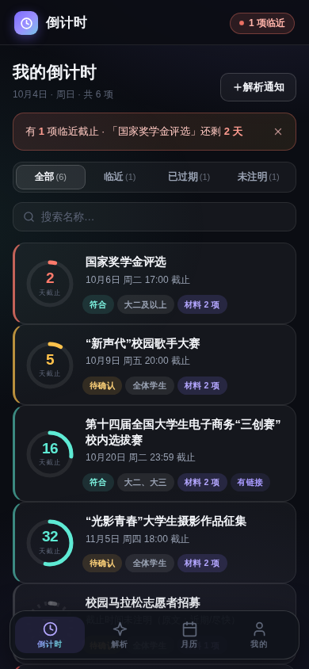
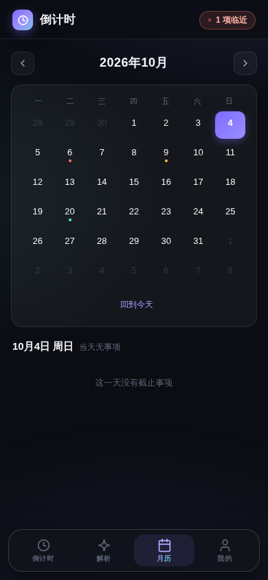

# 倒计时 · Countdown

粘贴一段竞赛/评奖通知，AI 自动提取关键信息，生成你的专属倒计时日程。



由 915 行的 Python 命令行工具 [award_tracker.py](award_tracker.py) 演化而来：v1 是离线规则解析的「赛事管家」，**v2 更名「倒计时」并全面升级**——接入 agnes-2.5-flash 大模型解析、全新深色界面、环形倒计时卡片。数据仍只存在你自己的设备上。

## 下载安装

到 [Releases 页面](../../releases) 下载对应文件：

| 平台 | 文件 | 使用方式 |
|------|------|----------|
| Android 7.0+ | `countdown-v2.0.0.apk` | 下载后点开安装（v1 用户可直接覆盖安装，数据自动沿用） |
| iPhone / 电脑浏览器 | `countdown-v2.0.0.html` | 下载后用浏览器直接打开 |

> **Android 安装提示**：首次安装会提示「来自未知来源」——非应用商店分发的正常提示，允许即可。应用仅申请网络权限（用于 AI 解析），本地解析、月历、记录管理等功能完全离线可用。

## 功能一览

- **✨ AI 智能解析**：粘贴通知原文，agnes-2.5-flash 自动提取赛事名称、截止日期与时刻（年份智能推断）、报名方式、材料清单、年级 / 专业限制、链接；一次可粘贴多条通知。AI 不可用时自动回退本地规则引擎，离线也能用
- **⏰ 环形倒计时**：每条记录一张倒计时卡片，环形进度随剩余天数收敛，颜色按紧急度分级（≤3 天珊瑚红 / ≤7 天琥珀 / ≤15 天紫 / 更远青绿 / 已过期红），「今天 / X 天前」一目了然
- **🎯 画像匹配**：按你的年级与专业给每条通知打标（符合 / 待确认 / 年级不符），只排序不过滤；改画像自动全库重新打标
- **📅 月程月历**：月历总览当月截止事项，事项圆点颜色与倒计时卡片一致，点击日期查看当日清单
- **🔔 临近提醒**：顶栏徽章 + 可关闭提醒条，提醒天数可自定义（1/3/5/7/自定义）
- **🗂 记录管理**：临近 / 已过期 / 未注明分类筛选、名称搜索、删除二次确认、入库自动查重
- **💾 数据自主**：数据存本机 localStorage，JSON 一键导出 / 导入备份；v1「赛事管家」数据无缝升级



## 仓库结构

```
award_tracker.py      # 原始 Python CLI 版本（功能母本）
app/index.html        # App 单文件版（APK 内置同一文件，浏览器可直接打开）
docs/                 # 截图与图标
```

## 技术说明

- App 采用 WebView 外壳 + 单文件离线 HTML 架构：安装包仅 87KB
- APK 由 `aapt2 + d8 + zipalign + apksigner` 手工工具链构建，minSdk 24 / targetSdk 34，v2+v3 签名；v1、v2 使用同一签名证书，可原地覆盖升级
- AI 解析走 OpenAI 兼容的 `/v1/chat/completions`（`response_format: json_object`），内置三重 JSON 容错（围栏剥离 / 未转义引号修复 / 截断补齐）；解析失败自动切换本地规则
- 界面为深色设计系统：无 flex-gap / clamp / backdrop-filter 等新语法，兼容 Chromium 55+ 的旧 WebView
- JS 规避可选链、lookbehind 等新特性，保证旧设备可用

## 版本历史

- **v2.0.0**（2026-10）：更名「倒计时」。接入 agnes-2.5-flash AI 解析（本地规则作离线回退）；全新深色 UI（环形倒计时卡片 / 悬浮 Dock / 月历重绘）；新时钟图标；v1 数据无缝迁移
- **v1.0.0**（2026-10）：首个 App 版本「赛事管家」，功能与 CLI 对齐并增强（月历视图、可视化筛选、JSON 备份）
