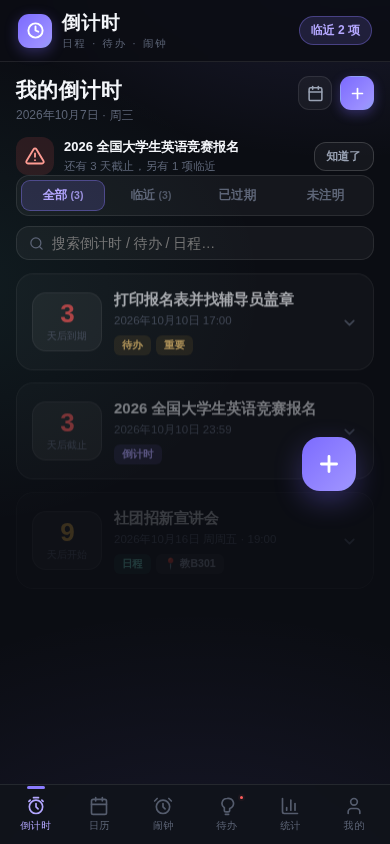
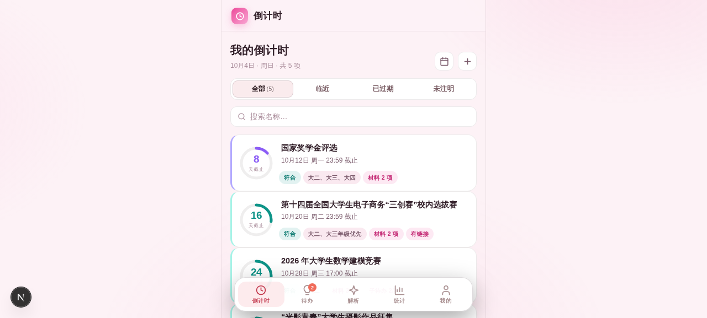

# 倒计时 · Countdown

粘贴一段通知、拍一张截图，AI 自动提取关键信息，生成你的专属倒计时日程与待办清单。



由 915 行的 Python 命令行工具 [award_tracker.py](award_tracker.py) 演化而来：v1 是离线规则解析的「赛事管家」，v2 更名「倒计时」接入 AI 解析，v3 升级为日程 + 待办一体的事项管理工具，**v4 成为日程 · 待办 · 闹钟 · 日历全能版**——完整闹钟系统、重复日程与提醒、六套界面主题、数据库持久化云同步。

## 下载安装

到 [Releases 页面](../../releases) 下载对应文件：

| 平台 | 文件 | 使用方式 |
|------|------|----------|
| Android 7.0+ | `countdown-v4.0.0.apk` | 下载后点开安装（v3 用户在应用内「检查更新」即可升级，数据无损） |
| iPhone / 电脑浏览器 | `countdown-v4.0.0.html` | 下载后用浏览器直接打开 |
| 任何设备（免下载） | 网页版 | 直接访问 **https://dddl.space-z.ai**（与 App 功能一致，云同步互通） |

> **Android 安装提示**：首次安装会提示「来自未知来源」——非应用商店分发的正常提示，允许即可。应用仅申请网络权限（用于 AI 解析、云同步与版本检测），本地记录、待办、月历等功能完全离线可用。

## v4.0.0 新特性

- **🐛 修复云同步数据问题**：服务端改为数据库持久化（SQLite），冷启动不丢数据；快照覆盖日程、待办、闹钟、日历全部数据；跨设备逐项合并（最新修改优先），删除有墓碑防复活；「我的 → 云同步 → 服务器地址」可自定义同步服务器
- **🐛 修复待办无法编辑**：备注、日期、时间、优先级现在全部可以点开编辑并自动保存；修复点击输入框时整行误折叠的问题；子待办支持在待办与倒计时日程下添加
- **⏰ 完整闹钟系统**：一次性 / 每天 / 工作日 / 周末 / 自定义星期重复；稍后提醒（5/10/15/30 分钟）；5 种铃声（经典 / 清脆 / 鸟鸣 / 数字 / 渐强）；音量渐强温柔唤醒；振动；响铃全屏界面；App 关闭后由系统级通知准时提醒（新版 APK），开机自动恢复
- **📅 完整日历系统**：日程支持时间段、地点、备注、颜色分类；重复规则（每天/每周/每两周/每月/每年/工作日/自定义）；提前提醒可多选（准时/5分/15分/30分/1小时/1天）；月视图 + 日程列表双模式；日程 / 截止 / 待办 / 闹钟四类标记
- **🎨 六套界面主题**：星夜 / 深海 / 翡翠 / 暖阳 / 樱粉 / 素墨；六大页签布局全新重构
- **📊 统计汇总**：待办完成率环形图、近 7 天完成柱状图、子待办进度、已完成清单
- **🧠 智能解析保留**：极速 / 均衡 / 深度三档（界面不显示具体模型名），支持截图识图，AI 不可用自动回退本地规则

## v3.0.0 新特性

- **✅ 完整待办系统**：独立的待办清单（支持日期、备注），做完划掉、可展开编辑；倒计时日程卡片里还能展开添加**子待办**（进度条实时统计）；已完成可折叠，统计视图汇总全部完成情况
- **🖼 图片智能解析**：通知截图 / 拍照直接解析——AI 自动识别图中的截止日期、材料、报名方式，不用再手动敲字
- **🧠 三档智能模式**：极速 / 均衡 / 深度三档解析引擎切换，待办与日程智能区分，可一键互转；AI 不可用时仍自动回退本地规则
- **🎨 五套界面风格**：星夜（深色）/ 翡翠 / 暖阳 / 樱粉 / 素墨，一键切换即存
- **☁️ 数据上云**：8 位同步码，手机 App 与网页版（https://dddl.space-z.ai）之间跨平台同步日程与待办，逐项合并不丢数据
- **🔄 应用内自更新**：自动检测新版本，Android 端可直接在应用内完成升级（热替换页面，无需重装、数据无损）
- **➕ 手动添加**：不想解析？表单直接手动添加 / 编辑日程，子待办批量录入
- **📊 统计视图**：日程四宫格、待办完成度环形图、子待办进度、即将到期、最近完成，一屏掌握全局

## 功能一览

- **⏰ 环形倒计时**：每条日程一张倒计时卡片，环形进度随剩余天数收敛，紧急度配色（≤3 天珊瑚红 / ≤7 天琥珀 / ≤15 天紫 / 更远青绿 / 已过期红）
- **🎯 画像匹配**：按你的年级与专业给每条通知打标（符合 / 待确认 / 年级不符），只排序不过滤
- **📅 月程月历**：月历总览当月截止事项（日程与带日期待办），点击日期查看当日清单
- **🔔 临近提醒**：顶栏徽章 + 提醒条 + 待办角标，提醒天数自定义
- **🗂 记录管理**：临近 / 已过期 / 未注明筛选、搜索、删除二次确认、入库查重
- **💾 数据自主**：数据存本机 localStorage；JSON 导出 / 导入备份；云同步完全可选、按你的同步码隔离



## 仓库结构

```
award_tracker.py      # 原始 Python CLI 版本（功能母本）
app/index.html        # App 单文件版（APK 内置同一文件，浏览器可直接打开）
docs/                 # 截图与图标
```

## 技术说明

- **APK**：WebView 外壳 + 单文件 HTML（ES5 兼容旧 WebView），手工工具链构建（aapt2 / d8 / zipalign / apksigner，minSdk 24 / targetSdk 34），v1 → v3 同一签名证书可覆盖升级
- **应用内更新**：`DaoUpdate` JS 桥把新版本页面写入应用私有目录（`filesDir/app.html`）并热切换，localStorage 同源故数据无损；首启自动从 asset 自安装并交接旧数据
- **云同步**：网页版服务器提供 `POST/GET /api/sync` 接口（同步码为键的快照存取，CORS 全开，APK 的 file:// 环境亦可直连）；客户端逐项 LWW 合并 + 删除墓碑 + 30 天清理
- **AI 解析**：OpenAI 兼容接口，`response_format: json_object` 结构化输出 + 三层 JSON 容错（围栏剥离 / 内引号修复 / 截断补齐）；识图走 base64 data URL 直传
- **网页版**：Next.js 16（App Router）+ Prisma/SQLite，根路由同源挂载单文件应用，`/api/version` 从应用内 `APP_VERSION` 常量实时解析版本

## 从 v1 / v2 升级

- 同一签名证书：直接覆盖安装，无需卸载
- 同一存储迁移链：v1「赛事管家」/ v2「倒计时」数据在 v3 首次启动时自动迁移
- APK 首启自动完成 asset → filesDir 的同源切换，此后所有应用内更新数据零丢失
